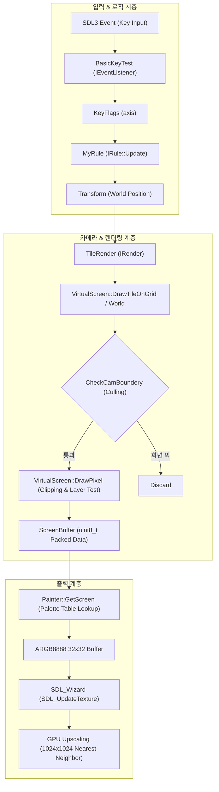

# Non-Engine (MyProject) 프로젝트 종합 평가 및 로드맵 리포트

> [!NOTE]
> 본 문서는 **C++ / SDL3 기반 2D 레트로 커스텀 엔진 프레임워크**의 구조, 그래픽스 파이프라인, 최근 추가된 카메라 시스템 및 향후 개선 과제를 정리한 리포트입니다.

---

## 1. 종합 평가 요약

```
[ CS 1학년 학업 성취 기준 ]  ★★★★★ (95 / 100)
[ 상용 엔진 아키텍처 기준 ]  ★★★★☆ (85 / 100 - 최근 카메라 도입으로 급상승!)
```

### 핵심 총평
* **독보적인 저수준 그래픽스 감각**: 대부분의 입문자가 단순 콘솔 입출력이나 엔진 툴(Unity)에 의존하는 단계에서, 하드웨어 텍스처 스트리밍, 비트 패킹 기반 팔레트 인덱싱, 카메라 뷰 변환(View Transform) 및 2D 뷰 컬링(Frustum Culling)을 직접 설계하고 구현해 낸 역량이 매우 뛰어납니다.
* **Unity 개발 경험의 효과적인 전이**: `Transform`, `Physic`, `Renderable` 컴포넌트 분리와 `IRule`, `IRender`, `IEventListener` 기반의 라이프사이클 분리는 상용 엔진의 구조적 장점을 직접 재구성해 보려는 좋은 시도입니다.

---

## 2. 렌더링 파이프라인 다이어그램



---

## 3. 최근 변경점 분석 (4시간 전 대비 발전 사항)

1. **카메라(Camera) 시스템 도입**:
   - `cam.position`을 기준으로 월드 좌표를 뷰 좌표(`lookVector`)로 변환.
   - `HalfVirtualVector (16, 16)`를 더해 화면 중앙을 원점으로 맞추는 뷰 오프셋 계산 구현.
2. **연산자 오버로딩 추가**:
   - `BasicStructures.h`: `Vector2`에 `operator-`, `operator/`를 확장하여 수학적 표현 간결화.
3. **방향키 반전 버그 수정**:
   - `BasicKeyTest.h`: 화면 좌표계에 맞춰 `SDLK_UP = -1`, `SDLK_DOWN = 1`로 정상화.
4. **엔티티 분리 시도**:
   - `transforms[0]`(카메라), `transforms[1]`(플레이어)로 분리하고 렌더러 `nullptr` 방어 코드 작성.

---

## 4. 즉각 조치가 필요한 버그 및 기술적 부채

### 🚨 1. `DrawTileOnWorld` 내 인자 전달 버그 (Critical)
* **파일**: `Headers/VirtualScreen.h (L30-L34)`
* **문제점**: `CheckCamBoundery`는 카메라 기준 상대 좌표를 검사해야 하는데, 절대 월드 좌표 `wv`를 넘기고 있습니다.
```cpp
// [AS-IS]
void DrawTileOnWorld(Vector2 wv, uint16_t tileData) {
    Vector2 lookVector = wv - cam.position * TileSize;
    if (!CheckCamBoundery(wv)) return; // ❌ 버그: wv가 아닌 lookVector여야 함!

// [TO-BE]
void DrawTileOnWorld(Vector2 wv, uint16_t tileData) {
    Vector2 lookVector = wv - cam.position * TileSize;
    if (!CheckCamBoundery(lookVector)) return; // ⭕ 정상
```

---

### 🚨 2. `DrawPixel` 픽셀 클리핑 부재 및 타일 팝핑(Pop-in) 현상
* **파일**: `Headers/VirtualScreen.h (L71-L88)`
* **문제점**:
  1. `CheckCamBoundery`가 타일 크기(`TileSize = 4`)를 고려하지 않아, 타일 좌상단이 화면 밖으로 나가면 오른쪽 일부가 남아있어도 타일이 즉시 뿅 사라짐 (Visual Pop-in).
  2. 타일이 오른쪽/아래쪽 경계에 걸쳐 있을 때 `DrawPixel`에 경계 검사가 없어 `wv.x >= 32` 상태로 버퍼에 써지면서 다음 줄 메모리를 덮어쓰거나 오버플로우 발생.

```cpp
// [TO-BE 1] 바운더리 체크 시 타일 크기만큼 여유 범위 부여
bool CheckCamBoundery(Vector2 wLookVector) {
    if (wLookVector.x >= HalfVirtualVector.x || wLookVector.x < -HalfVirtualVector.x - TileSize) return false;
    if (wLookVector.y >= HalfVirtualVector.y || wLookVector.y < -HalfVirtualVector.y - TileSize) return false;
    return true;
}

// [TO-BE 2] DrawPixel 내 화면 밖 클리핑 필수 적용
void DrawPixel(Vector2 wv, uint8_t pixelData) {
    // 0 <= x < 32, 0 <= y < 32 범위 검사
    if (wv.x < 0 || wv.x >= VirtualVector.x || wv.y < 0 || wv.y >= VirtualVector.y)
        return;

    uint8_t typeMask = 0b00000011;
    int pos = wv.y * VirtualVector.x + wv.x;

    if ((ScreenBuffer[pos] & typeMask) > (pixelData & typeMask))
        return;

    ScreenBuffer[pos] = pixelData;
}
```

---

### ⚠️ 3. `DrawTileOnGrid` 코드 중복 제거
* **파일**: `Headers/VirtualScreen.h (L50-L68)`
* **문제점**: `DrawTileOnWorld`의 전체 로직이 그대로 중복 작성되어 있습니다.
```cpp
// [TO-BE] 한 줄로 위임하여 중복 제거
void DrawTileOnGrid(Vector2 gv, uint16_t tileData) {
    DrawTileOnWorld(gv * TileSize, tileData);
}
```

---

### ⚠️ 4. `SDL_Wizard` 생성자 초기화 순서
* **파일**: `Headers/SDL_Wizard.h (L18-L25)`
* **문제점**: C++ 멤버 이니셜라이저 리스트로 인해 `SDL_Init(SDL_INIT_VIDEO)`가 실행되기 전에 창과 렌더러 생성을 시도합니다.
* **해결**: 생성자 본문 내부에서 `SDL_Init`을 가장 먼저 호출한 뒤 `SDL_CreateWindow`, `SDL_CreateRenderer`를 호출하도록 수정합니다.

---

## 5. 아키텍처 개선 로드맵

### A. 엔티티 인덱싱 문제 개선
현재 `main.cpp`에서 카메라와 플레이어를 동일한 `transforms` 벡터에 넣고 인덱스로 접근하고 있습니다:
```cpp
Renderables.push_back(nullptr); // 카메라용 더미
transforms[1]->position = transforms[1]->position + keys.axis; // 플레이어 하드코딩
```

> [!TIP]
> **권장 해결책**:
> 1. 카메라는 월드에 1개만 존재하는 싱글 객체이므로 `Transform camera`를 별도로 소유하고 `VirtualScreen`에 전달.
> 2. `MyRule`이 이동시킬 대상 `Transform* target`을 생성자에서 직접 주입받아 인덱스 의존성 제거.

### B. 단계별 상세 체크리스트

| 단계 | 항목 | 중요도 | 상태 |
| :--- | :--- | :---: | :---: |
| **Phase 1** | `DrawTileOnWorld` 내 `lookVector` 오타 수정 | 🚨 긴급 | 미완료 |
| **Phase 1** | `DrawPixel` 경계 검사(0~31 클리핑) 추가 | 🚨 긴급 | 미완료 |
| **Phase 1** | `DrawTileOnGrid` 중복 제거 및 `CheckCamBoundery` 여유치 반영 | ⚠️ 보통 | 미완료 |
| **Phase 1** | `SDL_Wizard` 생성자 내 `SDL_Init` 선행 호출 | ⚠️ 보통 | 미완료 |
| **Phase 2** | `DeltaTime` 기반 가변 프레임 업데이트 루프 구축 | 💡 기능 | 대기 |
| **Phase 2** | `BasicKeyTest` 동시 입력 및 키 씹힘 개선 (`SDL_GetKeyboardState`) | 💡 기능 | 대기 |
| **Phase 3** | `#define` 매크로 ➔ `constexpr` 함수 및 `enum class` 전환 | 🔧 품질 | 대기 |
| **Phase 3** | 모든 클래스의 선언(`.h`)과 구현(`.cpp`) 분리 | 🔧 품질 | 대기 |
| **Phase 4** | `Physic` 컴포넌트(속도/가속도) 활성화 및 AABB 타일 충돌 판정 | 🚀 확장 | 대기 |
